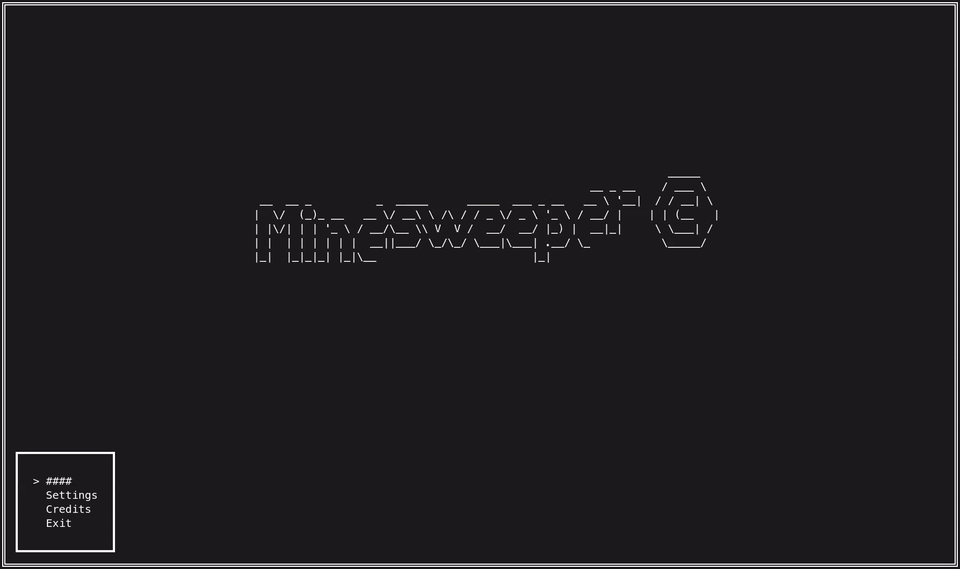
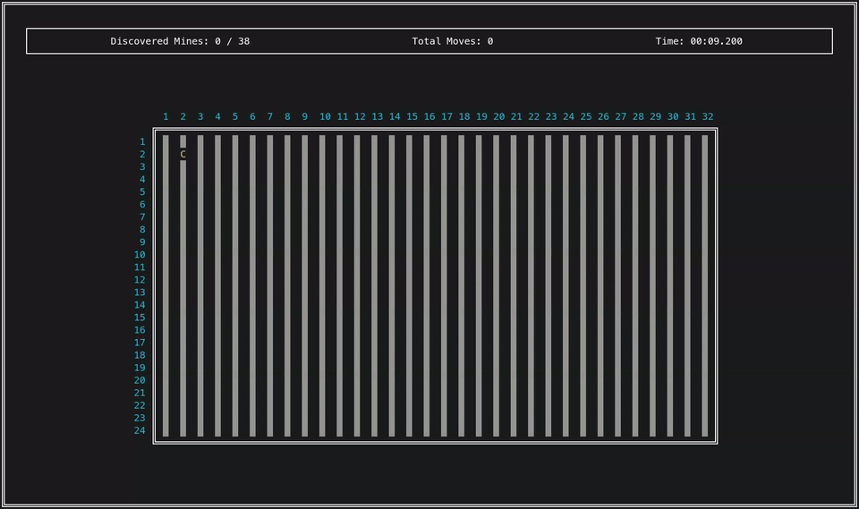

# Minesweeper Game

## Description

A modern implementation of the classic minesweeper game. Clear the grid without hitting hidden mines. Choose from multiple difficulty levels and track your best scores on the local scoreboard.

## Game Controls

**Menus:**
- **WASD / Arrow Keys**: Navigate
- **Enter**: Select option
- **Esc**: Exit menu
- **P**: Take screenshot

**Game:**
- **WASD / Arrow Keys**: Move cursor
- **Enter / Space**: Uncover cell
- **F**: Flag/unflag cell

## Building

### Linux

Simply run the build script:
```sh
./run.sh
```

This will build and launch the game automatically.

### Windows

1. Install Visual Studio with C++ support and CMake
2. Open the project folder in Visual Studio
3. Visual Studio will automatically detect CMakePresets.json
4. Select a preset from the CMake menu and build
5. Run the executable from the build folder

Alternatively, use CMake directly:
```cmd
mkdir build
cd build
cmake .. -G "Visual Studio 17 2022"
cmake --build . --config Release
cd ..
minesweeper.exe
```

## Dependencies

- **Windows**: pdcurses (automatically downloaded and built by CMake)
- **Linux**: ncurses (install via `sudo apt install libncurses-dev` on Debian/Ubuntu)
- **All platforms**: C++23 compatible compiler, CMake 3.15+

## Features

- Multiple difficulty levels
- Local scoreboard
- Cross-platform support

## Licensing

MIT License. See LICENSE file for details.

---

## Screenshots

### Main Menu


### Gameplay

